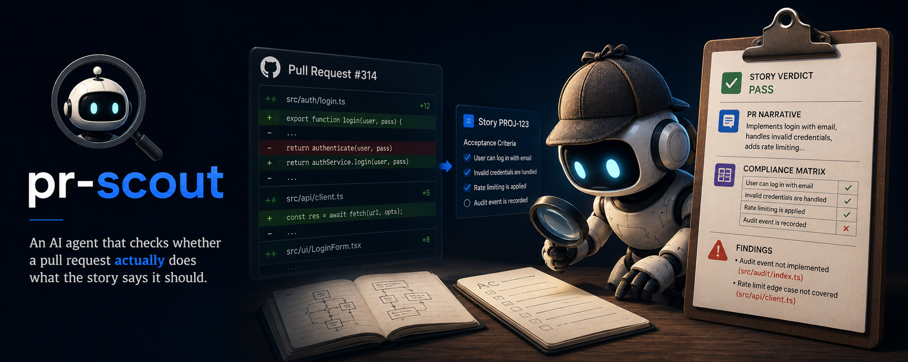

<div align="center">



# pr-scout
> An AI agent that checks whether a pull request actually does what the story says it should.

<p>
  <a href="#what-you-get">What You Get</a> •
  <a href="#tldr">TL;DR</a> •
  <a href="#quick-start">Quick Start</a> •
  <a href="#existing-ai-systems-supported">Existing AI Systems Supported</a> •
  <a href="#mcp-setup">MCP Setup</a> •
  <a href="#daily-usage">Daily Usage</a> •
  <a href="#output-files">Output Files</a> •
  <a href="#prerequisites">Prerequisites</a>
</p>

<p>
  <a href="https://www.linkedin.com/in/shuchita-jain/"></a>&nbsp;
  <a href="https://medium.com/@coderSJ"></a>
</p>


</div>

---

Point it at a PR and a story ID. It reads the diff, fetches your acceptance criteria, and tells you what's implemented, what's missing, and what smells off. Every claim comes with file-level evidence. No lint noise, no style opinions, no generic scorecards.

---

## What You Get

**A briefing, not a wall of comments.**

Every run produces a `briefing.md` with four sections:

- **Story Verdict**: pass, partial, or blocked, per story
- **PR Narrative**: a plain-English walkthrough of what the change actually does
- **Compliance Matrix**: each acceptance criterion mapped to its evidence in the diff
- **Findings**: up to 5 concrete risks, each with a file reference and a reviewer question

**Inline review comments, ready to post.**

After the briefing, pr-scout writes a `review-comments.json` and proposes the list in chat. You review them, drop or edit any you don't want, and confirm. It posts the approved set directly to the PR via your VCS (GitHub, GitLab, Bitbucket, Azure DevOps). Nothing gets posted without your sign-off.

## TL;DR

```text
/pr-scout self-check for story PROJ-123              # check uncommitted changes
/pr-scout self-check against main for story PROJ-123 # all commits not yet in main
/pr-scout review pr 314 for story PROJ-123           # review an open PR
/pr-scout review pr 314 for story PROJ-123 PROJ-456  # review against multiple stories
/pr-scout review pr 314 for story PROJ-123 include-plan  # triangle check with plan file
```

- Outputs: `.ai/pr-scout/outputs/<pr-or-ref>/`

## Quick Start

From the root of your project repo:

```bash
git clone https://github.com/shuchitajain/pr-scout.git ./pr-scout
./pr-scout/scripts/pr-scout init .
```

What init does:

- creates `.ai/pr-scout/` in the target repo
- copies `agents/`, `prompts/`, and `outputs/` from pr-scout into `.ai/pr-scout/` in the target repo, without overwriting existing files
- creates or updates `AGENTS.md` in the repo root with a short pr-scout usage paragraph
- creates or updates `CLAUDE.md` when a `CLAUDE.md` file is already present
- updates `.claude/rules/pr-scout.md` when a `.claude/rules/` directory is already present
- installs `.github/agents/` wrappers when a `.github/` directory is detected (GitHub Copilot mode-dropdown agents)
- installs `.cursor/skills/` wrappers when a `.cursor/` directory is detected
- adds `.ai/pr-scout/` to `.gitignore`
- merges pr-scout MCP servers into existing MCP config files (`.vscode/mcp.json`, `.cursor/mcp.json`, `.mcp.json`, `~/.claude.json`, etc.) without removing existing servers

Running init multiple times is safe and idempotent.

Prompt behavior across IDEs:

- canonical agents always live in `.ai/pr-scout/agents/`
- `.github/agents/` files are GitHub Copilot mode-dropdown wrappers (registered in the Copilot Chat agent selector); must use the `.agent.md` extension
- `.cursor/skills/` files are Cursor skill wrappers (invoked with `/pr-scout`)
- IDE wrapper files delegate to the canonical agents; they are not the source of truth

## Existing AI Systems Supported

- **All repos:** `AGENTS.md` is created (or appended to) with a pr-scout usage paragraph.
- **Claude Code:** `CLAUDE.md` is updated when already present. `.claude/rules/pr-scout.md` is updated when `.claude/rules/` exists.
- **GitHub Copilot:** `.github/agents/` wrappers are installed when a `.github/` directory is detected.
- **Cursor:** `.cursor/skills/` wrappers are installed when a `.cursor/` directory is detected.

All installs are additive. Existing content is never replaced.

## MCP Setup

pr-scout does not assume ownership of a single MCP config path.

- if one or more MCP config files already exist (VS Code, Cursor, Claude-style), init merges required pr-scout servers (`jira`, `github`) only when missing
- if no MCP config exists, init creates one in the most likely workspace path (`.cursor/mcp.json`, `.mcp.json`, `.roo/mcp.json`, `.windsurf/mcp.json`, or fallback `.vscode/mcp.json`)
- existing server definitions are preserved

These two servers are opinionated defaults covering the two roles pr-scout uses:

| Role | Default server | Replace with |
|---|---|---|
| Tracker | `jira` (`mcp-atlassian`) | Any Jira-compatible, Linear, ADO, or GitHub Issues MCP |
| VCS | `github` (`@modelcontextprotocol/server-github`) | GitLab, ADO, Bitbucket, or other VCS MCP |

To use a different server, replace or remove the relevant entry in `.ai/pr-scout/templates/vscode/mcp.json` before running init — or edit your MCP config directly after install.

Claude Code note:
- Claude Code user/local MCP: `~/.claude.json` (default)
- Claude Code project MCP: `.mcp.json` (repo root)
- init merges both if they already exist
- init does not auto-create `~/.claude.json` (to avoid unexpected global machine-level changes)

Template used for merge:

`.ai/pr-scout/templates/vscode/mcp.json`

## Daily Usage

All `/pr-scout` commands must run in agent mode.

```text
/pr-scout self-check for story PROJ-123
/pr-scout self-check against main for story PROJ-123
/pr-scout self-check against origin/qa for story PROJ-123
/pr-scout self-check commit a3f9c2b against origin/main for story PROJ-123
/pr-scout self-check against main for story PROJ-123 PROJ-456
/pr-scout review pr 314 for story PROJ-123
/pr-scout review pr 314 for story PROJ-123 PROJ-456
/pr-scout review pr 314 for story PROJ-123 include-plan
```

After the briefing, pr-scout presents the proposed inline comments and waits. Drop some, edit others, or approve as-is. When you're ready, tell it to post and it will push the approved set to the PR via your VCS.

Story IDs are fetched directly from your tracker (Jira, etc.). PR-Scout looks for acceptance criteria in a dedicated AC field first, then in description sections headed `Acceptance Criteria` or `AC`, then in checklist-like issue content when clearly used that way. If story text is fetched but no reliable AC block is found, it reports `AC missing from fetched payload` and asks you for pasted AC or the correct field name/key. If a story isn't in a connected tracker, paste the text and acceptance criteria instead.

## What It Won't Do

pr-scout is deliberately narrow. It does not:

- Check lint, formatting, or style
- Score code quality in the abstract
- Generate tests
- Review code unrelated to the story

If a finding isn't grounded in a specific file and a story risk, it doesn't appear.

## Output Files

Inside `.ai/pr-scout/outputs/<pr-or-ref>/`:

- `briefing.md` — story verdict (pass / partial / blocked), PR narrative, compliance matrix, and up to 5 grounded findings
- `review-comments.json` — proposed inline review comments, each anchored to a file and line; presented for approval before anything is posted
- `manual-todo.md` — created only when input fetch or parsing gaps exist (missing AC block, inaccessible PR, unresolved story)

## Prerequisites

Install `uv` (provides `uvx`, used by MCP servers):

```bash
curl -LsSf https://astral.sh/uv/install.sh | sh
which uvx && uvx --version
```

Add tracker and VCS credentials to `.env` (copy from `.env.example`).

## Safety + Scope

- Keep secrets in `.env`/environment variables; never commit real tokens
- `.ai/pr-scout/outputs/` should stay gitignored
- pr-scout never posts review comments without explicit human approval — it presents the proposed set and waits for confirmation before calling the VCS API

## Development

See [CONTRIBUTING.md](CONTRIBUTING.md).

## Owner

- Shuchita Jain
